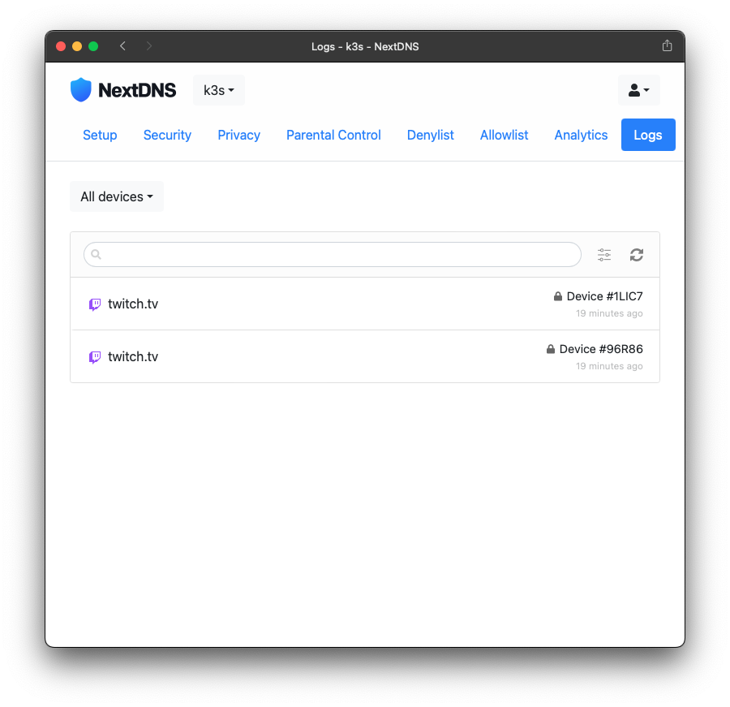

# NextDNS CLI for Kubernetes

NOTE: This is a WIP. The docker-compose example was converted to Kubernetes using [kompose](https://kompose.io/) and then messed around with.

0. Obtain your NextDNS Profile ID(s) from the [NextDNS web interface](https://my.nextdns.io)

1. Create a k8s secret with your NextDNS Profile configuration

    ```bash
    kubectl create secret generic nextdns-profile --from-literal=profile1=1a2s3d4f --from-literal=profile2=a1s2d3f4
    ```

2. Deploy the NextDNS docker image from Github Container Registry

    ```bash
    kubectl apply -f nextdns.yaml
    # view and inspect the daemonset (pods expose on each k8s node available externally)
    kubectl describe daemonset nextdns

    # view and inspect the pods in deployment
    kubectl get pods | grep nextdns
    kubectl describe pods nextdns-<pod-id>
    kubectl logs -f nextdns-<pod-id>
    ```

3. Verify the service is working by querying the service using `nslookup` 

    ```bash
    # using the `EXTERNAL-IP` from any of your node IP network address
    nslookup twitch.tv <EXTERNAL-IP>
    ```


